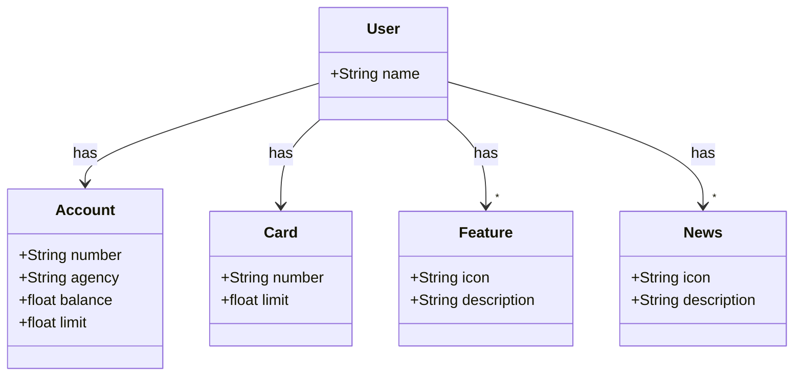

# Projeto Santander RESTFul 
Java RESTFul API criada para a Santander Dev Week

## Diagrama de Classes

```mermaid
classDiagram
    class User {
        +String name
    }
    
    class Account {
        +String number
        +String agency
        +float balance
        +float limit
    }
    
    class Feature {
        +String icon
        +String description
    }
    
    class Card {
        +String number
        +float limit
    }
    
    class News {
        +String icon
        +String description
    }
    
    User --> Account : has
    User --> Card : has
    User --> "*" Feature : has
    User --> "*" News : has
```
